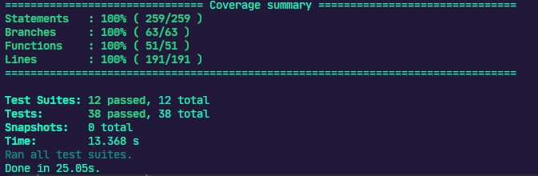

# Desafio 8 do Ignite Trilha NodeJS


<h3 align="center">
  Desafio 08: Transferências com a FinAPI

</h3>

<p align="center">
  
  <a href="https://app.rocketseat.com.br/me/matheus-marins">
    
  </a>
  <a href="https://github.com/rocketseat-education/ignite-template-database-queries/stargazers">
      
    </a>
  </p>

---

# :rocket: Sobre o desafio

Nesse desafio  implementei  uma nova funcionalidade na FinAPI, a aplicação que foi testada durante o desafio **[Testes unitários](https://www.notion.so/0321db2af07e4b48a85a1e4e360fcd11)**.

A nova funcionalidade  permiti a transferência de valores entre contas. 

### **Para saber tudo sobre o desafio acesse [NotionDesafio](https://www.notion.so/Desafio-01-Transfer-ncias-com-a-FinAPI-5e1dbfc0bd66420f85f6a4948ad727c2#9ea7dd4726c948a685019a21b42c7561).**
 
---
### :keyboard: Instalação e Execução do Projeto

- Clone este repositório

```
> git clone https://github.com/Mar0la/ignite-transferencias-com-finapi
```

- Navegue até o diretório principal do projeto

```
> cd ignite-transferencias-com-finapi
```

- Instale as dependências com o Yarn

```
yarn
```

- Rode a suite de testes

```
yarn test
```
---

### **Retorno que devemos ter ao digitar  <code>yarn test</code>** no terminal
  

---

## FeedBack do Desafio
  - Não sei o que dizer.
---


